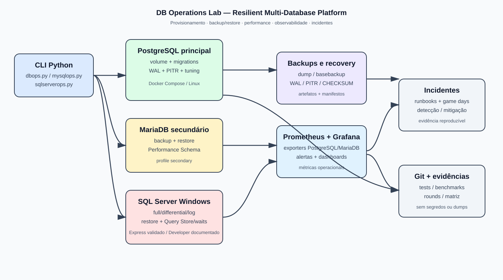

# DB Operations Lab — Resilient Multi-Database Platform

Laboratório reproduzível de DBA/DevOps para PostgreSQL, MySQL/MariaDB e SQL Server: provisionamento, backup/restauração, PITR, performance, observabilidade e resposta a incidentes.

Repositório: [github.com/CalvinSoares/DBOps-Lab](https://github.com/CalvinSoares/DBOps-Lab)

## Sobre o projeto

Este projeto simula uma plataforma operacional de bancos de dados para um ambiente de e-commerce ou chamados. O PostgreSQL é o banco principal e concentra a implementação mais completa. MariaDB e SQL Server são extensões operacionais validadas com profundidade proporcional ao ambiente disponível.

O laboratório foi construído para demonstrar:

- provisionamento automatizado e idempotente;
- usuários, roles e permissões separadas;
- migrations e health checks;
- backup lógico, backup físico e WAL;
- recuperação point-in-time (PITR);
- testes reais de restauração;
- diagnóstico de queries, índices e locks;
- métricas com Prometheus e Grafana;
- runbooks e simulações de incidentes;
- automação operacional com Python e Docker.

## Arquitetura

O ambiente principal roda em Docker Compose. A CLI Python coordena provisionamento, health checks, backup, restore e diagnósticos. PostgreSQL é o caminho crítico; MariaDB roda como extensão no perfil secondary; SQL Server é executado separadamente no Windows. Backups, WAL e evidências ficam separados dos volumes de dados para que possam ser inspecionados e restaurados.

## Evidências de competência

As principais evidências já produzidas são:

- provisionamento e permissões: [automation/dbops.py](automation/dbops.py);
- backup e PITR: [postgres/](postgres/) e [evidence/phase-0/round-007.md](evidence/phase-0/round-007.md);
- tuning antes/depois: [benchmarks/postgres/runs/20261004T000351Z_a48486b9/result.json](benchmarks/postgres/runs/20261004T000351Z_a48486b9/result.json);
- observabilidade validada: [evidence/phase-0/monitoring-result-20261004T165141Z.json](evidence/phase-0/monitoring-result-20261004T165141Z.json);
- MariaDB operacional: [evidence/phase-6/round-019.md](evidence/phase-6/round-019.md);
- SQL Server backup/restore/performance: [evidence/phase-7/round-022.md](evidence/phase-7/round-022.md);
- game day de indisponibilidade: [evidence/phase-5/incident-database-down-20261004T165037Z.json](evidence/phase-5/incident-database-down-20261004T165037Z.json);
- runbooks operacionais: [incidents/](incidents/).

Os números apresentados no projeto vêm de artefatos de execução. Metas de RPO/RTO não são tratadas como resultados até que sejam medidas em um teste correspondente.

## Pré-requisitos

- Docker Engine ou Docker Desktop com Docker Compose;
- Python 3.12 ou compatível;
- PowerShell, Linux shell ou ambiente equivalente;
- pelo menos 2 GB livres para imagens, banco e backups;
- portas livres conforme o perfil usado: 15432, 13306, 9090, 3000, 9187, 9188 e 19100;
- SQL Server Windows/Express ou Developer separado para a extensão SQL Server.

O caminho principal de execução é Linux via Docker/WSL2. SQL Server é documentado separadamente para Windows/VM em [sqlserver/README.md](sqlserver/README.md). Se a porta 3000 estiver ocupada, defina `GRAFANA_PORT` no `.env` e use a porta escolhida nos links locais.

## Instalação rápida

Clone o repositório e entre na pasta do projeto:

~~~powershell
git clone https://github.com/CalvinSoares/DBOps-Lab.git
Set-Location DBOps-Lab
~~~

Crie o ambiente local:

~~~powershell
Copy-Item .env.example .env
python -m venv .venv
.\.venv\Scripts\Activate.ps1
python -m pip install -r automation/requirements.txt
~~~

Edite o .env local e substitua as senhas de laboratório. O arquivo .env é ignorado pelo Git e não deve ser publicado.

## Executar o PostgreSQL

Suba o banco principal:

~~~powershell
docker compose up -d postgres
~~~

Aplique roles e migrations:

~~~powershell
python automation/dbops.py provision
~~~

Valide conectividade, versão, migrations, permissões e espaço:

~~~powershell
python automation/dbops.py health-check
~~~

O provisionamento é idempotente. Pode ser executado novamente sem reaplicar migrations já registradas.

## Operações de backup e recuperação

Backup lógico:

~~~powershell
python automation/dbops.py backup
~~~

Backup físico:

~~~powershell
python automation/dbops.py backup --type physical
~~~

Os dois tipos:

~~~powershell
python automation/dbops.py backup --type both
~~~

Verificar um backup lógico:

~~~powershell
python automation/dbops.py verify-backup <arquivo.dump>
~~~

Restaurar em banco isolado:

~~~powershell
python automation/dbops.py restore <arquivo.dump>
~~~

Verificar arquivamento de WAL:

~~~powershell
python automation/dbops.py wal-status
~~~

Executar PITR em cluster separado:

~~~powershell
python automation/dbops.py pitr --base-artifact <diretorio-do-backup-fisico> --cleanup
~~~

O backup lógico gera manifesto e SHA-256. O backup físico gera backup_manifest, manifesto externo e validação com pg_verifybackup. O PITR usa o backup físico, os WALs arquivados e um horário-alvo.

## Performance e diagnóstico

Executar o benchmark PostgreSQL:

~~~powershell
python automation/benchmark_postgres.py --rows 200000 --cleanup
~~~

O benchmark registra:

- plano antes e depois;
- EXPLAIN (ANALYZE, BUFFERS);
- tempo de execução;
- buffers lidos e encontrados;
- linhas removidas pelo filtro;
- índice aplicado;
- estatísticas após ANALYZE;
- sessão bloqueadora e sessão aguardando.

## Monitoramento

Subir o banco junto com Prometheus, Grafana e exporters:

~~~powershell
docker compose --profile monitoring --profile secondary up -d
python automation/check_monitoring.py
python automation/check_mariadb_monitoring.py
~~~

Acessos locais:

- Grafana: [http://localhost:3000](http://localhost:3000)
- Prometheus: [http://localhost:9090](http://localhost:9090)
- PostgreSQL Exporter: [http://localhost:9187/metrics](http://localhost:9187/metrics)
- MariaDB Exporter: [http://localhost:9188/metrics](http://localhost:9188/metrics)
- Node Exporter: [http://localhost:19100/metrics](http://localhost:19100/metrics)

O dashboard PostgreSQL acompanha disponibilidade, conexões, tamanho, transações, deadlocks, queries ativas, idade de query, locks, idade/falha de backup, CPU e memória. O dashboard MariaDB acompanha disponibilidade, conexões, threads ativos, queries lentas, uptime e temporárias em disco.

## Incidentes e game days

Os runbooks estão em [incidents/](incidents/). O executor geral usa dry-run por padrão:

~~~powershell
python automation/run_incident.py slow-query
~~~

Game days controlados:

~~~powershell
python automation/run_incident.py slow-query --execute --duration 20 --observe-prometheus
python automation/run_incident.py lock --execute --observe-prometheus
python automation/run_incident.py backup-invalid --execute
~~~

O game day isolado de indisponibilidade usa outro projeto Compose e não interrompe o banco principal:

~~~powershell
python automation/run_database_down.py
python automation/run_database_down.py --execute
~~~

Operações destrutivas no banco principal, como parar o serviço ou preencher disco, não são executadas automaticamente. Elas exigem ambiente descartável, janela autorizada e procedimento de recuperação.

## Status operacional atual

O núcleo PostgreSQL, os backups, PITR, tuning, observabilidade e os principais game days estão implementados e possuem evidências. O ciclo operacional do MariaDB foi validado com provisionamento, health check, backup lógico, verificação de checksum, restore separado, consistência pós-restore, Performance Schema, game day isolado de indisponibilidade e coleta Prometheus/Grafana. A Fase 7 de SQL Server foi validada no Windows com Express, full/differential/log, CHECKSUM, restore separado e análise de Query Store/waits; a limitação de compressão da edição está documentada. Kubernetes possui manifests opcionais para PostgreSQL, mas a validação runtime depende de um cluster acessível e não substitui backup, replicação ou alta disponibilidade.

## Estrutura do repositório

~~~text
.
├── automation/       # CLI, checks e game days Python
├── benchmarks/       # planos e medições de performance
├── incidents/        # runbooks e Compose descartável
├── migrations/       # schema e controle de migrations
├── monitoring/       # Prometheus, Grafana, exporters e alertas
├── postgres/         # backups, WAL e recuperação
├── mysql/            # extensão MySQL/MariaDB
├── sqlserver/        # documentação SQL Server/Windows
├── kubernetes/       # etapa opcional stateful
├── portfolio/        # descrição pública e bullets de currículo
├── evidence/         # resultados reproduzíveis das execuções
└── tests/            # testes automatizados
~~~

## Segurança e escopo

Este é um projeto de laboratório. Não use as senhas de exemplo em produção, não versione .env, dumps, tokens ou dados reais. Antes de apresentar o projeto, substitua qualquer métrica de exemplo por evidência produzida no seu próprio ambiente.
